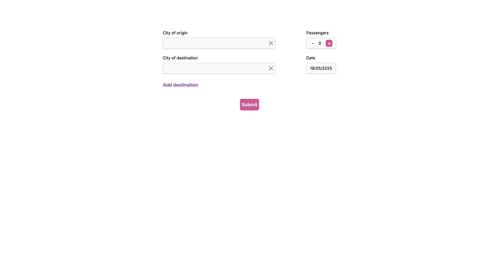

# 🚚 TestLogistic

TestLogistic is a logistics-related web application built with **React** and **TypeScript**. It follows modern front-end development practices and is deployed via Vercel.

- 🔗 **Live Demo**: [test-logistic-eta.vercel.app](https://test-logistic-eta.vercel.app)
- 🔗 **Backend**: [TestLogisticBack](https://github.com/DmitryFullStackDev/TestLogisticBack)


---

## ✨ Features

- ⚛️ React + TypeScript + Redux
- 🧹 Linting with ESLint
- 🎨 Code formatting with Prettier
- 📱 Responsive design
- 🚀 Deployed on Vercel

---

## 🛠️ Getting Started

### 📋 Prerequisites

- 🟢 Node.js (v14+)
- 📦 npm or yarn

### 📥 Installation

```bash
git clone https://github.com/DmitryFullStackDev/TestLogistic.git
cd TestLogistic
npm install
# or
yarn install
```

### ▶️ Running the App
```yaml
npm run build
# or
yarn build

```

### 🧾 Project Structure
````yaml
TestLogistic/
├── public/             📁 Static assets
├── src/                📁 Source code
│   ├── components/     🧩 Reusable UI components
│   ├── pages/          📄 Page views
│   ├── App.tsx         🧠 Root component
│   └── index.tsx       🚪 Entry point
├── .eslintrc.js        📏 Linting config
├── .prettierrc         🎨 Formatting rules
├── package.json        📦 Project metadata
└── tsconfig.json       🧪 TypeScript settings

````

### 📸 Preview

